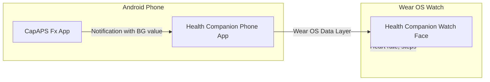

# Health Companion

A Wear OS watch face that displays time, glycemia (blood glucose), heart rate, and steps.

**Latest release:** [v1.0.0](RELEASES.md#release-v100) · [Changelog](CHANGELOG.md) Glycemia values are automatically synced from **CapAPS Fx** notifications on your Android phone via the Wear OS Data Layer.

Use this repository to build and run the app yourself on your own devices.

---

## Features

| Feature | Description |
|---------|-------------|
| **Time & Date** | Large time display with date (dd/MM/yyyy) underneath |
| **Glycemia** | Blood glucose from CapAPS Fx, synced from phone notifications |
| **Glycemia Trend** | Sparkline chart showing last 24 readings |
| **Heart Rate** | Live BPM from watch sensor (♥ icon) |
| **Steps** | Step count from watch sensor (👣 icon) |
| **Status Colors** | Green (in range), orange (high), red (low/very high) |

---

## How It Works



1. **CapAPS Fx** on your phone sends notifications with glycemia readings.
2. **Health Companion** (phone app) reads those notifications and syncs the value to the watch via Wear OS Data Layer.
3. The **watch face** shows time, glycemia, sparkline, heart rate, and steps.

---

## Permissions

### Phone App (Health Companion)

| Permission | Purpose | When Required |
|------------|---------|---------------|
| **Notification Access** | Read glycemia from CapAPS Fx notifications | On first launch – user must enable in Settings |
| `INTERNET` | Network (Expo/React Native) | Automatic |
| `READ_EXTERNAL_STORAGE` | Storage (React Native) | Automatic |
| `WRITE_EXTERNAL_STORAGE` | Storage (React Native) | Automatic |
| `VIBRATE` | Haptic feedback | Automatic |
| `SYSTEM_ALERT_WINDOW` | Overlay (if used) | Automatic |

**Important:** The phone app must be granted **Notification Access** (Settings → Apps → Special app access → Notification access → Health Companion). Without this, glycemia will not sync to the watch.

### Watch App (Health Companion)

| Permission | Purpose | When Required |
|------------|---------|---------------|
| `BODY_SENSORS` | Heart rate sensor | Granted when opening the app – enables heart rate on watch face |
| `ACTIVITY_RECOGNITION` | Step counter sensor | Granted when opening the app – enables steps on watch face |

**Important:** Open the Health Companion app on the watch once and accept both permissions. The watch face will retry sensor registration periodically (every 30 seconds) if permissions are granted later.

---

## Prerequisites

- **Node.js** ≥ 18.0.0  
- **npm** ≥ 9.0.0  
- **Android Studio** (for building)  
- **JDK 17+**  
- **Android phone** with CapAPS Fx installed  
- **Wear OS watch** (e.g. Samsung Galaxy Watch, Pixel Watch)  
- **CapAPS Fx** app sending notifications with glycemia values  

---

## Installation

### 1. Clone and Install Dependencies

```bash
git clone https://github.com/saffist3r/HealthCompanion.git
cd HealthCompanion
npm install
```

### 2. Build Shared Package

```bash
npm run build -w @health-companion/shared
```

(Or run `npm run prepare` which builds shared and applies patches.)

### 3. Build and Install Phone App

```bash
npm run build:mobile
cd apps/mobile && npx expo run:android
```

Or use Android Studio to build and run the phone app on a connected device/emulator.

### 4. Grant Notification Access (Phone)

1. Open the Health Companion app on your phone.
2. Tap **Open settings** or go to **Settings → Apps → Special app access → Notification access**.
3. Enable **Health Companion**.

### 5. Build Watch App

```bash
npm run build:watch
```

Or for debug:

```bash
cd apps/watch/android && ./gradlew app:assembleDebug
```

The APK will be at:

- Debug: `apps/watch/android/app/build/outputs/apk/debug/app-debug.apk`
- Release: `apps/watch/android/app/build/outputs/apk/release/app-release.apk`

### 6. Install Watch App

**Option A: Watch connected via Bluetooth ADB**

```bash
# Forward ADB through phone
adb forward tcp:4444 localabstract:/adb-hub
adb connect localhost:4444

# Install
adb -s localhost:4444 install -r apps/watch/android/app/build/outputs/apk/debug/app-debug.apk
```

**Option B: Watch connected via WiFi**

1. On the watch: **Settings → Developer options** → Enable **ADB debugging** and **Debug over WiFi**.
2. Note the watch IP and port (e.g. `192.168.1.96:5555`).
3. Install:

```bash
adb connect 192.168.1.96:5555
adb -s 192.168.1.96:5555 install -r apps/watch/android/app/build/outputs/apk/debug/app-debug.apk
```

**Option C: WiFi pairing script**

```bash
./scripts/install-watch-wifi.sh <IP> <pairing_port> <code> [connection_port]
# Example: ./scripts/install-watch-wifi.sh 192.168.1.96 40199 153951
```

### 7. Grant Watch Permissions

1. Open **Health Companion** on the watch (tap the app icon).
2. When prompted, grant **Body sensors** (heart rate) and **Activity recognition** (steps).
3. Select the **Health Companion** watch face from the watch face picker.

---

## Project Structure

```
HealthCompanion/
├── apps/
│   ├── mobile/                 # Phone app (Expo / React Native)
│   │   ├── App.tsx             # Main UI
│   │   ├── index.ts            # Entry, notification listener
│   │   └── src/
│   │       └── wearSync.ts     # Sync glycemia to watch via Data Layer
│   └── watch/                  # Wear OS watch app
│       └── android/
│           └── app/src/main/java/.../watch/
│               ├── HealthCompanionWatchFaceService.kt   # Watch face
│               ├── GlycemiaDataListenerService.kt       # Receives data from phone
│               ├── GlycemiaHolder.kt                    # Glycemia state
│               ├── HeartRateHolder.kt / HeartRateMonitor.kt
│               ├── StepsHolder.kt / StepsMonitor.kt
│               └── MainActivity.kt                      # App UI + permission requests
├── packages/
│   ├── shared/                 # Shared code (parsing, types)
│   │   └── src/index.ts        # parseGlycemiaFromNotification, isCapAPSFxPackage
│   └── database/               # Shared database types
├── patches/                    # patch-package patches (e.g. notification listener + Wear)
├── scripts/
│   └── install-watch-wifi.sh   # Install watch app via WiFi
└── README.md
```

---

## Building

| Command | Description |
|---------|-------------|
| `npm run mobile` | Start phone app dev server |
| `npm run watch` | Start watch app dev server |
| `npm run build:mobile` | Build phone app |
| `npm run build:watch` | Build watch app (release) |
| `npm run build -w @health-companion/shared` | Build shared package |

---

## CapAPS Fx Compatibility

The app parses glycemia from CapAPS Fx (CamAPS FX) notifications. Supported package IDs include:

- `com.camdiab.fx_alert.mmoll`
- `com.camdiab.fx_alert.mgdl`
- `com.camdiab.fx_alert`
- `com.camdiab`

Supported formats in notification text:

- `X.X mmol/L`, `X.X mg/dL`
- `BG: X.X`, `Glucose: X.X`, `CGM: X.X`
- Other common patterns (see `packages/shared/src/index.ts`)

---

## Troubleshooting

### No glycemia on watch

1. **Notification access** – Ensure Health Companion has Notification Access on the phone.
2. **Phone and watch paired** – Both must be connected (Bluetooth or WiFi).
3. **Sync from phone** – Open the Health Companion phone app; it syncs on launch. You can also use any “Sync to watch” action if available.
4. **CapAPS notifications** – CapAPS Fx must have sent at least one notification with a glycemia value.
5. **Refresh on watch** – Open the watch app and tap the screen to trigger a refresh.

### Heart rate shows "♥ --"

1. **Grant BODY_SENSORS** – Open the Health Companion app on the watch and accept the Body sensors permission.
2. **Wait for retry** – The watch face retries sensor registration every 30 seconds.
3. **Device support** – Some Wear OS 4+ devices limit direct heart rate sensor access; behavior may vary by manufacturer.

### Steps show "👣 --"

1. **Grant ACTIVITY_RECOGNITION** – Open the Health Companion app on the watch and accept the Activity recognition permission.
2. **Step sensors** – The app uses `TYPE_STEP_COUNTER` (cumulative) or `TYPE_STEP_DETECTOR` (per-step) as fallback. Support varies by device.
3. **Walk with watch** – On some devices, the step sensor updates mainly when the screen is on or after movement.

### Watch face not in picker

On Wear OS 5+ (e.g. Galaxy Watch 7), traditional Jetpack watch faces may not appear. You can still use the Health Companion app: open it and leave it on screen to view time, glycemia, heart rate, and steps.

---

## License

[Add your license here, e.g. MIT, Apache 2.0]

---

## Contributing

Contributions are welcome. Please open an issue or pull request.
